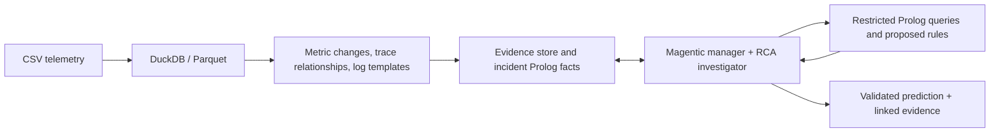

# Magentic neuro-symbolic RCA

The pipeline is implemented and runnable through the supplied submission interface. The comparisons below describe the first implementation; subsequent reliability changes and their checks are recorded in `eval/reliability-results.json`. It converts telemetry to compact, source-linked observations, then lets a Microsoft Agent Framework Magentic manager and one investigator query those observations and execute incident-local Prolog. It has not yet demonstrated an accuracy advantage over its numerical fallback.

## Submission readiness — latest changes, not yet live-evaluated

Tool-generation failures are now separate from provider availability. Unknown names and invalid arguments receive corrective feedback; retries are bounded. When tools are disabled, their definitions are omitted and emitted calls cannot execute. The investigator completion gate remains authoritative.

The readiness pass passed 46 offline tests, the official output validator, two constrained Linux offline cases, real-data Prolog arithmetic/aggregation, and the offline evaluation harness. It made no live model calls. The prepared routed-versus-fixed comparison has **not run**; earlier results below must not be attributed to this latest version. See [READY.md](READY.md) for its launch command and packaging checklist.

## Reliability pass — latest implementation

Implemented complete sanitized tracing, paginated/versioned KB inspection, grounded arithmetic and aggregation, executable RCA prompt examples, typed diagnosis labels, and an investigator-only completion tool. Magentic cannot mark an investigation complete without the accepted investigator result; manager synthesis cannot replace it. Evidence reports link accepted Prolog executions and assumptions. Provisional and fallback answers are explicitly incomplete.

Validation: **39 offline tests passed**, including a complete simulated Magentic/tool/Prolog/completion round trip and preservation of interrupted provider traces. The official shape validator passed with zero warnings. The rebuilt Linux image executed aggregation and arithmetic against the real dataset with no network, a read-only root filesystem, 2 CPUs and an 8 GB limit; it counted 41 memory candidates and returned 82 for twice that count.

Two planned live development cases used a 180-second ceiling:

| Case | Time | Successful Prolog / executed | Saved provisional | Completed investigation | Strict / partial score |
|---|---:|---:|---|---|---|
| 0 | 180.02 s | 8 / 8 | Yes | No — deadline | 0 / 0.5 |
| 1 | 44.61 s | 1 / 1 | No | No — invalid tool generation | 1 / 1.0 |

Case 1's correct scored output came from fallback, not a completed investigation. Case 0 also had two tool-argument validation failures before execution: `rules` was supplied as a string instead of a JSON list. The trace captures the requests and exact framework errors; these are not included among the nine successful Prolog executions.

The remaining concrete blocker is tool-loop recovery. GLM-5.1 generated tagged calls to nonexistent `inspect_evidence` twice while `tool_choice=none`. The adapter rejected those calls and counted response-processing failures toward model unavailability, eventually terminating the workflow. No further live tuning or broad evaluation was performed after identifying this failure. Next work should distinguish generation errors from provider availability and inspect why the investigator continues requesting tools instead of submitting completion when the framework ends its tool loop.

This pass added approximately **$0.4821** in recorded model spending; cumulative development spending is **$1.6468**, below both the additional $2 limit and original $10 cap. Costs include estimates for interrupted requests and remain subject to provider billing. Full traces are in `out/debug-reliability`; compact results are in [eval/reliability-results.json](eval/reliability-results.json).

## Earlier implementation and evaluation

## Design

Preprocessing is lazy and reused across cases. Raw samples remain in the telemetry/cache, while the KB contains summaries and relationships. Metric evidence retains baseline coverage, source filters, transformation assumptions, and onset intervals. Trace parent-child joins use both trace and span identity. Logs use bounded aggregation followed by Drain3 or structured proxy parsing.

The investigator can inspect competing components, fetch exact evidence, propose rules, run Prolog, and save a provisional diagnosis. Proposed clauses cannot replace measured facts. Recursive rules are tabled and execution is bounded. Successful bindings establish consequences of supplied assumptions; they do not prove causation. If the agent does not produce a valid evidence-linked answer within budget, the runner explicitly reports a numerical fallback.

## Validation

| Check | Observed result |
|---|---|
| Offline unit/integration tests | 19 passed |
| Official output-shape validator | Passed with zero warnings |
| Full local offline catalog | 70 cases, 57.18 seconds, 1.28 GB peak process RSS |
| Linux offline run, 2 CPUs / 8 GB, no network | 20 cases, 31.12 seconds, 752 MB peak container memory |
| Source evidence replay | 12/12 sampled untransformed metric summaries matched original CSV measurements |
| Generated Prolog in Linux, no network | Rule executed successfully, 41 bindings |

Offline runs validate processing and packaging, not live agent accuracy or latency. Source replay covers a small metric subset and does not validate inferred counter semantics, all modalities, or causal conclusions. The 20-case resource run preceded final parser hardening; the final image was additionally checked with a read-only filesystem and two offline cases. All persistent outputs are under `--out`.

## Evaluation protocol

The seeded split groups overlapping incident windows and reserves approximately 20% of the supplied catalog. Initial integration rows 0 and 1 are development-only. Runtime query files contain no answer columns; labels are opened only by the offline scorer. Each configuration and repeat starts with a separate cache. These are internal held-out cases from the supplied deployment, not the hidden judging deployments.

The routed configuration uses Flash models for bookkeeping and early investigation, then GLM-5.2/5.1 for later investigation and repairs. The fixed comparison uses GLM-5.2 throughout the same Magentic workflow. `offline` isolates the new numerical fallback. `baseline` retains the supplied heuristic, including its original UTC parsing behavior; this timezone difference limits attribution of any improvement over that baseline.

Development smoke comparisons used two cases, two repeats, and a 90-second ceiling. Held-out comparisons use four previously reserved cases, one repeat, and a 45-second ceiling. Cold preprocessing counts against both. A full 20-case live run has not been measured. The default runtime shares an 18-minute target across remaining cases; that control is not itself proof of accuracy under the judging limit.

## Measured comparisons

| Split / configuration | Repeat | Cases | Strict | Partial | Seconds | Dollars | Prolog OK / attempted |
|---|---:|---:|---:|---:|---:|---:|---:|
| development / routed | 0 | 2 | 0.50 | 0.50 | 180.3 | 0.3079 | 4/6 |
| development / routed | 1 | 2 | 0.50 | 0.50 | 103.7 | 0.0582 | 2/3 |
| development / fixed | 0 | 2 | 0.50 | 0.50 | 91.3 | 0.1149 | 0/2 |
| development / fixed | 1 | 2 | 0.50 | 0.50 | 180.4 | 0.1971 | 1/6 |
| development / offline | 0 | 2 | 0.50 | 0.50 | 2.5 | 0.0000 | 0/0 |
| development / baseline | 0 | 2 | 0.00 | 0.00 | 2.2 | 0.0000 | 0/0 |
| holdout / routed | 0 | 4 | 0.00 | 0.00 | 169.0 | 0.1619 | 0/0 |

Development strict-score variation was zero across the two repeats, but total wall time varied from 103.7–180.3 seconds for routing and 91.3–180.4 seconds for fixed GLM-5.2. Mean run cost was $0.1830 routed versus $0.1560 fixed. These samples show no routing advantage.

The participant stopped evaluation during the fixed-model held-out run: three cases had been saved and the fourth was interrupted. No complete fixed-model held-out aggregate is reported; held-out offline/baseline comparisons were not run. Recorded total development spend was approximately $1.15, excluding any unreported charge for the interrupted request.

Triage found that manager calls consumed 18.6–34.5 seconds per routed held-out case. In one case the manager concluded without invoking the investigator, despite the prompt requiring a turn. Output validation accepted its evidence IDs because initial candidates already supplied them. This is an orchestration enforcement gap: evidence linkage alone does not certify an investigation or a symbolic check.

Priorities for the next iteration: enforce an investigator/tool-execution completion gate; reduce planning overhead; diagnose framework/tool-loop failures; then isolate Prolog generation and diagnosis quality. Runtime code was left unchanged after the evaluation stop.

## Failure analysis and limits

- In development, 7 of 8 live case executions used the numerical fallback. One fixed-model case produced an accepted model proposal. Equal final scores do not establish equal investigation quality.
- Generated Prolog sometimes used unquoted hyphenated atoms, forbidden negation, or the wrong predicate arity. Those requests were rejected. Detailed instructions and bounded repairs do not eliminate this problem.
- Provider latency, malformed tool output, and model availability consumed substantial case budgets. The adapter normalizes streamed tool calls and supports model failover, but cannot guarantee a completed investigation.
- Anomaly magnitude can select downstream symptoms. Memory, I/O, and network signals require stronger discrimination than generic change ranking. Metric normality is not evidence that an entire component is healthy.
- Confidence is not calibrated. Trace duration units remain unverified; only raw values and ratios are reported. Logs are sampled by distinct-message frequency and may omit rare clues. A missing preceding baseline remains unknown.

The next accuracy experiment should isolate Prolog generation quality and orchestration latency before expanding the agent team. A Prolog specialist remains an option, not an implemented component. PyRCA, DoWhy-GCM, Z3, and SCRAM are deferred.

## Reproduction and attribution

See [OPERATIONS.md](OPERATIONS.md) for commands, pinned environments, budgets, and artifacts. The harness is [evaluate_pipeline.py](evaluate_pipeline.py); compact measured results are in [eval/](eval/). Full local traces remain under `track-1/out/` and are excluded from the container. Development model charges are estimated from provider usage, with conservative estimates for interrupted requests; provider billing is authoritative.

The participant selected the architecture and scope. OpenAI Codex generated and debugged the implementation, tests, and documentation. Runtime uses Microsoft Agent Framework Magentic and the permitted Featherless GLM models. Main representation tools are DuckDB, pandas, NumPy, Drain3, and SWI-Prolog. The original starter scorer and example baselines are retained.
